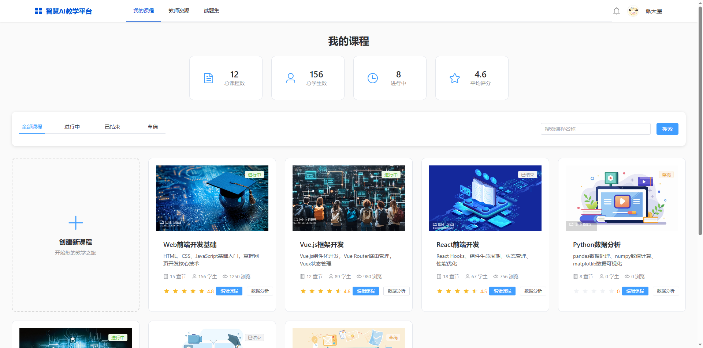
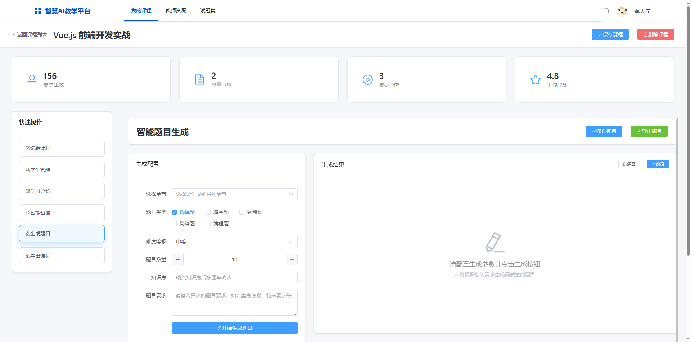
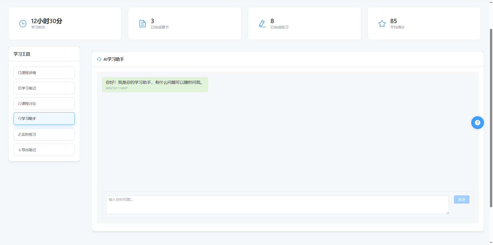
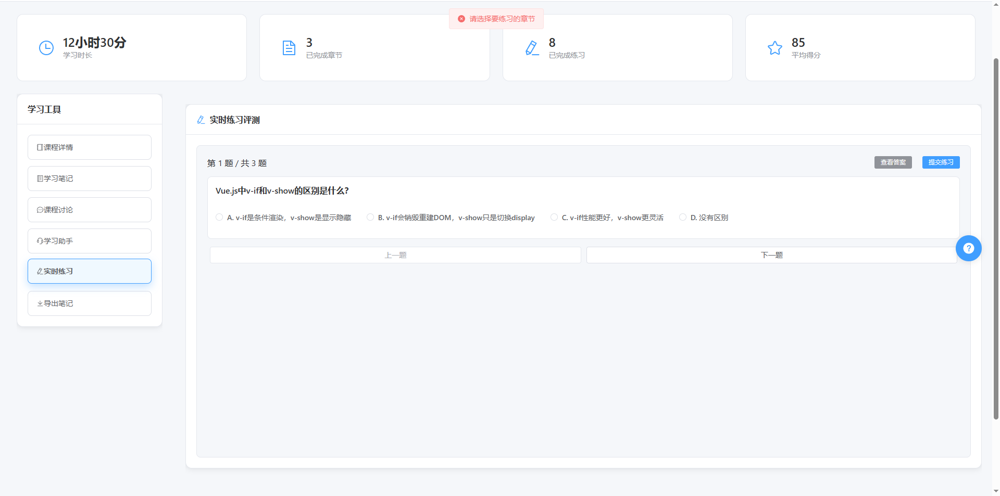
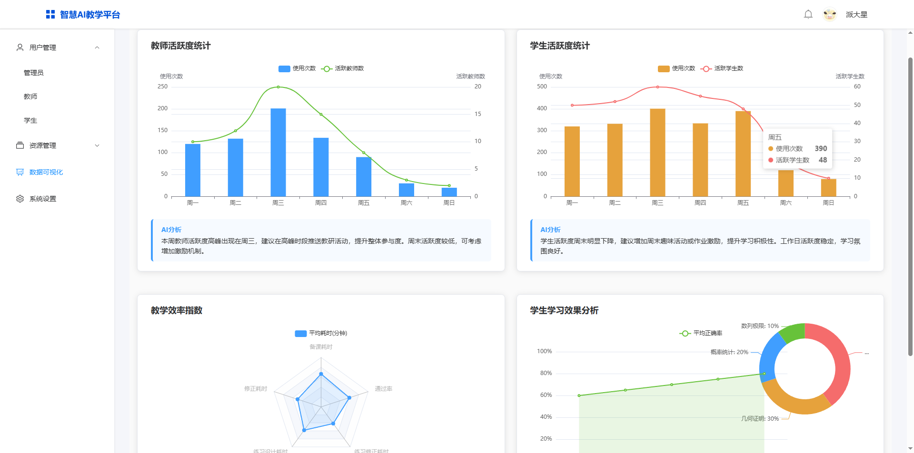

# Vue教育系统 (Vue EduSys)

一个基于Vue.js开发的现代化教育管理系统，支持课程管理、试题管理、学习助手等功能。

## 📋 目录

- [项目介绍](#项目介绍)
- [技术栈](#技术栈)
- [功能特性](#功能特性)
- [快速开始](#快速开始)
- [主要功能](#主要功能)
- [API文档](#api文档)
- [项目结构](#项目结构)
- [贡献指南](#贡献指南)

## 🎯 项目介绍

Vue教育系统是一个专为教育机构设计的综合管理平台，提供完整的教学管理解决方案。系统支持多角色管理（管理员、教师、学生），涵盖课程管理、试题管理、学习分析等核心功能。

### 核心特性

- 🎓 **多角色管理**：支持管理员、教师、学生三种角色
- 📚 **课程管理**：完整的课程创建、编辑、发布流程
- 📝 **试题管理**：智能试题生成、题库管理、自动评分
- 🤖 **AI助手**：集成GPT的学习助手，提供智能答疑
- 📊 **数据分析**：学习进度分析、成绩统计可视化
- 📁 **资源管理**：文档、视频、课件等教学资源管理

## 🛠 技术栈

- **前端框架**：Vue.js 3.x
- **路由管理**：Vue Router 4.x
- **状态管理**：Vuex 4.x
- **UI组件库**：Element Plus
- **HTTP客户端**：Axios
- **构建工具**：Vue CLI
- **代码规范**：ESLint + Prettier

## ✨ 功能特性

### 管理员功能
- 用户管理（教师、学生账户管理）
- 系统设置和配置
- 数据统计和可视化
- 资源管理

### 教师功能
- 课程创建和管理
- 试题库管理
- 学生成绩管理
- 学习资源上传

### 学生功能
- 课程学习和进度跟踪
- 在线练习和测试
- 学习助手智能答疑
- 个人学习记录

## 🚀 快速开始

### 环境要求

- Node.js >= 16.0.0
- npm >= 8.0.0

### 安装步骤

1. **克隆项目**
```bash
git clone https://github.com/your-username/vue-eduSys.git
cd vue-eduSys
```

2. **安装依赖**
```bash
npm install
```

3. **启动开发服务器**
```bash
npm run serve
```

4. **访问应用**
打开浏览器访问 `http://localhost:8080`

### 构建生产版本

```bash
npm run build
```

## 📖 主要功能

### 1. 用户登录系统

**功能描述**：支持多角色登录，包括管理员、教师、学生三种角色。

**使用说明**：
1. 访问登录页面
2. 输入用户ID和密码
3. 选择对应的角色类型
4. 点击登录按钮

**界面截图**：

*登录页面 - 展示登录表单和角色选择界面*


### 2. 课程管理

**功能描述**：教师可以创建、编辑、发布课程，管理课程内容和学习资源。

**使用说明**：
1. 进入教师控制台
2. 点击"我的课程"
3. 创建新课程或编辑现有课程
4. 上传课程资源（文档、视频等）
5. 发布课程供学生学习

**界面截图**：

*课程管理页面 - 展示课程列表和创建/编辑界面*


### 3. 试题管理系统

**功能描述**：支持试题集的创建、编辑、删除，以及智能试题生成。

**使用说明**：
1. 进入试题管理页面
2. 创建新的试题集
3. 添加题目（支持多种题型）
4. 使用AI生成试题
5. 管理题库和试题

**界面截图**：

*试题管理页面 - 展示试题集列表和题目编辑界面*


### 4. 学习助手（AI智能答疑）

**功能描述**：集成GPT的学习助手，为学生提供智能答疑和学习指导。

**使用说明**：
1. 进入学习助手页面
2. 输入学习问题或关键词
3. 系统自动匹配相关知识
4. 获得详细的解答和指导

**界面截图**：

*学习助手页面 - 展示对话界面和问答功能*


### 5. 学生练习系统

**功能描述**：学生可以在线练习题目，系统提供自动评分和解析。

**使用说明**：
1. 学生选择要练习的试题集
2. 开始答题
3. 提交答案
4. 查看评分和解析

**界面截图**：

*学生练习页面 - 展示答题界面和结果页面*


### 6. 数据可视化

**功能描述**：提供学习进度、成绩统计等数据的可视化展示。

**使用说明**：
1. 进入数据统计页面
2. 查看各种图表和统计数据
3. 分析学习趋势和效果

**界面截图**：

*数据可视化页面 - 展示各种图表和统计信息*

## 📚 API文档

详细的API文档请参考：[API文档](./src/api/README.md)

### 主要API模块

- **用户管理**：`/api/user.js`
- **课程管理**：`/api/section.js`
- **试题管理**：`/api/question.js`
- **文件管理**：`/api/file.js`
- **GPT功能**：`/api/gpt.js`

## 📁 项目结构

```
vue-eduSys/
├── public/                 # 静态资源
├── src/
│   ├── api/               # API接口
│   │   ├── user.js        # 用户相关API
│   │   ├── question.js    # 试题相关API
│   │   ├── section.js     # 课程相关API
│   │   ├── file.js        # 文件相关API
│   │   ├── gpt.js         # GPT相关API
│   │   └── index.js       # API统一导出
│   ├── assets/            # 资源文件
│   ├── components/        # 公共组件
│   │   ├── AdminSideBar.vue
│   │   ├── MainSideBar.vue
│   │   ├── file/          # 文件相关组件
│   │   ├── gpt/           # GPT相关组件
│   │   └── questions/     # 试题相关组件
│   ├── constants/         # 常量定义
│   ├── router/            # 路由配置
│   ├── store/             # 状态管理
│   ├── utils/             # 工具函数
│   └── views/             # 页面组件
│       ├── Admin/         # 管理员页面
│       ├── Teacher/       # 教师页面
│       ├── Student/       # 学生页面
│       └── Login/         # 登录页面
├── package.json
└── README.md
```


## 🔧 开发指南

### 代码规范

项目使用ESLint和Prettier进行代码规范控制：

```bash
# 检查代码规范
npm run lint

# 自动修复代码规范问题
npm run lint:fix
```

### 提交规范

使用Conventional Commits规范：

```bash
# 示例
git commit -m "feat: 添加用户登录功能"
git commit -m "fix: 修复试题显示bug"
git commit -m "docs: 更新README文档"
```

## 🤝 贡献指南

1. Fork 本仓库
2. 创建特性分支 (`git checkout -b feature/AmazingFeature`)
3. 提交更改 (`git commit -m 'Add some AmazingFeature'`)
4. 推送到分支 (`git push origin feature/AmazingFeature`)
5. 打开 Pull Request


## 🙏 致谢

感谢所有为这个项目做出贡献的开发者和用户！
